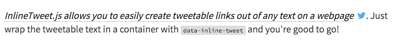

# InlineTweet.js



[SEE DEMO](http://ireade.github.io/inlinetweetjs/)


## How to Use


#### 1 - Include Script

[Download the file from here](https://raw.githubusercontent.com/ireade/inlinetweetjs/gh-pages/src/inline-tweet.min.js) and include it in your webpage.

```html
<script src="path/to/inline-tweet.min.js"></script>
```


#### 2 - Wrap Text

Wrap the tweetable text in a container element of your choice (`span` recommended) with the data attribute, `data-inline-tweet`


```html
<span data-inline-tweet>Lorem Khaled Ipsum is a major key to success</span>
```


#### 3 - Additional Options

You can add more data attributes to cutomise the tweeted output -

- `data-inline-tweet-via` — Add a twitter username (without the @) to append to the tweet
- `data-inline-tweet-tags` - Add hashtags to the tweet (comma-separated, no spaces)
- `data-inline-tweet-url` — Tweet a URL different to the current page url

```html
<span data-inline-tweet       
	  data-inline-tweet-via="ireaderinokun"   
	  data-inline-tweet-tags="webdesign,webdev,js,yolo"    
	  data-inline-tweet-url="bitsofco.de">   
	Lorem Khaled Ipsum is a major key to success 
</span>
```


#### 4 - Add Styles

Add the following styles to your stylesheet -

```css
[data-inline-tweet] a {   
	text-decoration: none;   
	color: #000; 
} 
[data-inline-tweet] a span {   
	border-bottom: 1px dotted rgb(0,172,237);   
	font-style: italic;      
	margin-right: 10px; 
} 
[data-inline-tweet] a:hover span {   
	background-color: rgba(0,172,237,0.1);   
	color: rgb(0,172,237); 
}
```

